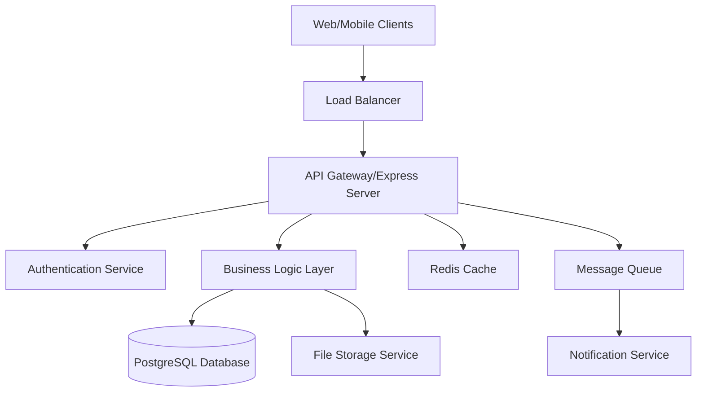

# Design Document

## Overview

The Tourist Hub API backend is designed as a RESTful web service that provides secure, role-based access to tour management functionality. The system employs a multi-tenant architecture with data isolation between providers while maintaining centralized system administration capabilities.

### Technology Stack Recommendation

- **Runtime:** Node.js with Express.js framework for high performance and extensive ecosystem
- **Database:** PostgreSQL for ACID compliance and complex relational queries
- **Authentication:** JWT (JSON Web Tokens) with refresh token rotation
- **File Storage:** AWS S3 or compatible object storage for document management
- **API Documentation:** OpenAPI 3.0 with Swagger UI
- **Validation:** Joi or Zod for request/response validation
- **ORM:** Prisma or TypeORM for database operations

## Architecture

### High-Level Architecture



### Data Isolation Strategy

The system implements logical data isolation through provider-scoped queries rather than physical database separation. This approach provides:
- Cost efficiency through shared infrastructure
- Simplified maintenance and updates
- Strong data isolation through application-level controls
- Centralized system administration capabilities

## Components and Interfaces

### API Endpoint Structure

#### Authentication Endpoints
```
POST /api/auth/login
POST /api/auth/refresh
POST /api/auth/logout
POST /api/auth/register
```

#### User Management Endpoints
```
GET    /api/users                    # SysAd only - all users
POST   /api/users                    # SysAd only - create user
GET    /api/users/{id}               # Role-based access
PUT    /api/users/{id}               # Self or authorized admin
DELETE /api/users/{id}               # SysAd or ProviderAdmin (own company)
GET    /api/users/{id}/documents     # Role-based document access
```

#### Provider Management Endpoints
```
GET    /api/providers                # SysAd only - all providers
POST   /api/providers                # SysAd only - create provider
GET    /api/providers/{id}           # SysAd or own provider
PUT    /api/providers/{id}           # SysAd or own provider admin
GET    /api/providers/{id}/users     # Provider-scoped user list
```

#### Tour Template Endpoints
```
GET    /api/tour-templates           # All authenticated users
POST   /api/tour-templates           # SysAd only
GET    /api/tour-templates/{id}      # All authenticated users
PUT    /api/tour-templates/{id}      # SysAd only
DELETE /api/tour-templates/{id}      # SysAd only
```

#### Custom Tour Event Endpoints
```
GET    /api/tour-events              # Provider-scoped or tourist's events
POST   /api/tour-events              # ProviderAdmin only
GET    /api/tour-events/{id}         # Role-based access
PUT    /api/tour-events/{id}         # ProviderAdmin (own events)
DELETE /api/tour-events/{id}         # ProviderAdmin (own events)
POST   /api/tour-events/{id}/register # Tourist registration
GET    /api/tour-events/{id}/schedule # Daily schedule access
```

#### Document Management Endpoints
```
GET    /api/documents                # User's own documents
POST   /api/documents                # Upload document
GET    /api/documents/{id}           # Role-based access
DELETE /api/documents/{id}           # Role-based deletion
GET    /api/documents/forms/blank    # Download blank forms
```

### Authentication and Authorization

#### JWT Token Structure
```json
{
  "sub": "user_id",
  "email": "user@example.com",
  "role": "Tourist|ProviderAdmin|SystemAdmin",
  "providerId": "provider_id_if_applicable",
  "iat": 1234567890,
  "exp": 1234567890
}
```

#### Role-Based Access Control Matrix

| Resource | SystemAdmin | ProviderAdmin | Tourist |
|----------|-------------|---------------|---------|
| All Users | CRUD | Read (own company) | Read (self) |
| All Providers | CRUD | Read/Update (own) | None |
| Tour Templates | CRUD | Read | Read |
| Tour Events | Read All | CRUD (own) | Read (registered) |
| Documents | Read All | CRUD (company users) | CRUD (own) |

## Data Models

### User Model
```typescript
interface User {
  userId: string;
  firstName: string;
  middleName?: string;
  lastName: string;
  emailAddress: string;
  phoneNumber: string;
  country: string;
  passwordHash: string;
  userType: 'SystemAdmin' | 'ProviderAdmin' | 'Tourist';
  status: 'Active' | 'Inactive';
  passportNumber?: string;
  dateOfBirth?: Date;
  gender?: string;
  providerId?: string; // For ProviderAdmin and Tourist
  createdAt: Date;
  updatedAt: Date;
}
```

### Provider Model
```typescript
interface Provider {
  providerId: string;
  companyName: string;
  country: string;
  addressLine1: string;
  addressLine2?: string;
  city: string;
  stateRegion: string;
  companyDescription: string;
  phoneNumber: string;
  emailAddress: string;
  corpIdTaxId: string;
  isIsolatedInstance: boolean;
  createdAt: Date;
  updatedAt: Date;
}
```

### TourTemplate Model
```typescript
interface TourTemplate {
  templateId: string;
  templateName: string;
  type: string;
  year: number;
  startDate: Date;
  endDate: Date;
  detailedDescription: string;
  sitesToVisit: SiteToVisit[];
  createdAt: Date;
  updatedAt: Date;
}
```

### CustomTourEvent Model
```typescript
interface CustomTourEvent {
  tourEventId: string;
  providerId: string;
  templateId: string;
  customTourName: string;
  startDate: Date;
  endDate: Date;
  packageType: string;
  place1Hotel: string;
  place2Hotel: string;
  numberOfAllowedTourists: number;
  remainingTourists: number;
  groupChatInfo?: string;
  status: 'Draft' | 'Active' | 'Full' | 'Completed' | 'Cancelled';
  dailySchedule: Activity[];
  registeredTourists: string[]; // User IDs
  createdAt: Date;
  updatedAt: Date;
}
```

### Document Model
```typescript
interface Document {
  documentId: string;
  userId: string;
  type: 'Passport' | 'Ticket' | 'TourForm' | 'Other';
  fileName: string;
  description?: string;
  uploadedByUserId: string;
  uploadDate: Date;
  fileStoragePath: string;
  fileSize: number;
  mimeType: string;
  createdAt: Date;
  updatedAt: Date;
}
```

## Error Handling

### Standardized Error Response Format
```typescript
interface ApiError {
  error: {
    code: string;
    message: string;
    details?: any;
    timestamp: string;
    path: string;
  };
}
```

### Error Categories
- **Authentication Errors (401):** Invalid credentials, expired tokens
- **Authorization Errors (403):** Insufficient permissions, data isolation violations
- **Validation Errors (400):** Invalid request data, missing required fields
- **Resource Errors (404):** Resource not found, invalid resource IDs
- **Business Logic Errors (422):** Registration conflicts, capacity limits
- **Server Errors (500):** Database failures, external service errors

### Error Handling Strategy
1. **Input Validation:** Validate all requests at the API boundary using schema validation
2. **Business Rule Validation:** Implement business logic validation in service layer
3. **Database Constraints:** Use database constraints as final validation layer
4. **Graceful Degradation:** Provide meaningful error messages and recovery suggestions
5. **Error Logging:** Log all errors with appropriate detail levels for debugging

## Testing Strategy

### Testing Pyramid

#### Unit Tests (70%)
- **Service Layer Tests:** Business logic validation, data transformation
- **Utility Function Tests:** Authentication helpers, validation functions
- **Model Tests:** Data model validation and relationships

#### Integration Tests (20%)
- **API Endpoint Tests:** Request/response validation, authentication flows
- **Database Integration Tests:** Repository layer testing with test database
- **External Service Tests:** File storage, notification service integration

#### End-to-End Tests (10%)
- **User Journey Tests:** Complete workflows for each user role
- **Cross-Role Interaction Tests:** Provider-Tourist interaction scenarios
- **Security Tests:** Authentication, authorization, data isolation validation

### Test Data Management
- **Test Database:** Separate PostgreSQL instance for testing
- **Data Fixtures:** Predefined test data for consistent testing scenarios
- **Test Isolation:** Each test suite uses isolated data sets
- **Mock Services:** Mock external dependencies for reliable testing

### Performance Testing
- **Load Testing:** Simulate concurrent user scenarios
- **Stress Testing:** Identify system breaking points
- **Database Performance:** Query optimization and indexing validation
- **File Upload Testing:** Large file handling and concurrent uploads

### Security Testing
- **Authentication Testing:** Token validation, session management
- **Authorization Testing:** Role-based access control validation
- **Data Isolation Testing:** Provider data separation verification
- **Input Validation Testing:** SQL injection, XSS prevention
- **File Upload Security:** Malicious file detection and handling