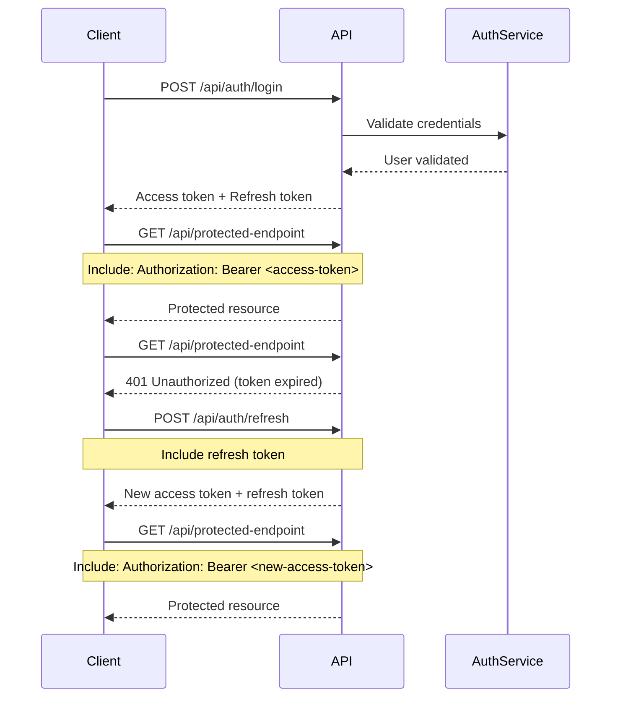

# Authentication Flow - Best Practices

This guide covers authentication best practices for integrating with the Tourist Hub API, including token management, security considerations, and error handling.

## Overview

The Tourist Hub API uses JWT (JSON Web Token) authentication with access and refresh token rotation. This provides a secure and scalable authentication mechanism while maintaining good user experience.

## Authentication Flow Diagram



## Implementation Best Practices

### 1. Token Storage

**Secure Storage Options:**

- **Web Applications**: Use secure HTTP-only cookies or secure browser storage
- **Mobile Applications**: Use platform-specific secure storage (Keychain, Android Keystore)
- **Server-side Applications**: Use environment variables or secure configuration files

**Example (JavaScript/Browser):**

```javascript
// Store tokens securely
const storeTokens = (accessToken, refreshToken) => {
  // Option 1: Secure localStorage (less secure)
  localStorage.setItem('accessToken', accessToken);
  localStorage.setItem('refreshToken', refreshToken);
  
  // Option 2: HTTP-only cookies (more secure, requires server setup)
  // Cookies are automatically included in requests
};

// Retrieve tokens
const getAccessToken = () => {
  return localStorage.getItem('accessToken');
};
```

### 2. Automatic Token Refresh

Implement automatic token refresh to provide seamless user experience:

```javascript
class ApiClient {
  constructor() {
    this.accessToken = null;
    this.refreshToken = null;
    this.isRefreshing = false;
    this.refreshPromise = null;
  }
  
  async makeRequest(url, options = {}) {
    // Add authorization header
    const headers = {
      ...options.headers,
      'Authorization': `Bearer ${this.accessToken}`
    };
    
    try {
      const response = await fetch(url, { ...options, headers });
      
      if (response.status === 401) {
        // Token expired, try refresh
        await this.refreshAccessToken();
        
        // Retry original request with new token
        headers['Authorization'] = `Bearer ${this.accessToken}`;
        return fetch(url, { ...options, headers });
      }
      
      return response;
    } catch (error) {
      throw error;
    }
  }
  
  async refreshAccessToken() {
    // Prevent multiple simultaneous refresh attempts
    if (this.isRefreshing) {
      return this.refreshPromise;
    }
    
    this.isRefreshing = true;
    this.refreshPromise = this.performTokenRefresh();
    
    try {
      await this.refreshPromise;
    } finally {
      this.isRefreshing = false;
      this.refreshPromise = null;
    }
  }
  
  async performTokenRefresh() {
    const response = await fetch('/api/auth/refresh', {
      method: 'POST',
      headers: { 'Content-Type': 'application/json' },
      body: JSON.stringify({ refreshToken: this.refreshToken })
    });
    
    if (!response.ok) {
      // Refresh failed, redirect to login
      this.logout();
      throw new Error('Token refresh failed');
    }
    
    const data = await response.json();
    this.accessToken = data.accessToken;
    this.refreshToken = data.refreshToken;
    
    // Update stored tokens
    this.storeTokens(data.accessToken, data.refreshToken);
  }
}
```

### 3. Request Interceptors

Use request interceptors to automatically handle authentication:

**Axios Example:**

```javascript
import axios from 'axios';

const apiClient = axios.create({
  baseURL: 'http://localhost:3000'
});

// Request interceptor to add auth token
apiClient.interceptors.request.use(
  (config) => {
    const token = getAccessToken();
    if (token) {
      config.headers.Authorization = `Bearer ${token}`;
    }
    return config;
  },
  (error) => Promise.reject(error)
);

// Response interceptor for token refresh
apiClient.interceptors.response.use(
  (response) => response,
  async (error) => {
    const originalRequest = error.config;
    
    if (error.response?.status === 401 && !originalRequest._retry) {
      originalRequest._retry = true;
      
      try {
        await refreshAccessToken();
        originalRequest.headers.Authorization = `Bearer ${getAccessToken()}`;
        return apiClient(originalRequest);
      } catch (refreshError) {
        // Redirect to login
        window.location.href = '/login';
        return Promise.reject(refreshError);
      }
    }
    
    return Promise.reject(error);
  }
);
```

### 4. Error Handling

Implement comprehensive error handling for authentication scenarios:

```javascript
const handleAuthError = (error) => {
  if (error.response) {
    switch (error.response.status) {
      case 401:
        // Unauthorized - token invalid or expired
        console.log('Authentication required');
        redirectToLogin();
        break;
        
      case 403:
        // Forbidden - insufficient permissions
        console.log('Access denied');
        showErrorMessage('You do not have permission to access this resource');
        break;
        
      case 422:
        // Validation error
        console.log('Invalid credentials');
        showErrorMessage('Invalid email or password');
        break;
        
      default:
        console.log('Authentication error:', error.response.data);
        showErrorMessage('Authentication failed. Please try again.');
    }
  } else {
    console.log('Network error:', error.message);
    showErrorMessage('Network error. Please check your connection.');
  }
};
```

### 5. Session Management

Implement proper session management:

```javascript
class SessionManager {
  constructor() {
    this.user = null;
    this.accessToken = null;
    this.refreshToken = null;
    this.sessionTimeout = null;
  }
  
  async login(email, password) {
    try {
      const response = await fetch('/api/auth/login', {
        method: 'POST',
        headers: { 'Content-Type': 'application/json' },
        body: JSON.stringify({ emailAddress: email, password })
      });
      
      if (!response.ok) {
        throw new Error('Login failed');
      }
      
      const data = await response.json();
      
      this.user = data.user;
      this.accessToken = data.accessToken;
      this.refreshToken = data.refreshToken;
      
      // Store tokens securely
      this.storeTokens(data.accessToken, data.refreshToken);
      
      // Set up session timeout
      this.setupSessionTimeout();
      
      return data;
    } catch (error) {
      this.handleAuthError(error);
      throw error;
    }
  }
  
  async logout() {
    try {
      if (this.refreshToken) {
        await fetch('/api/auth/logout', {
          method: 'POST',
          headers: { 
            'Content-Type': 'application/json',
            'Authorization': `Bearer ${this.accessToken}`
          },
          body: JSON.stringify({ refreshToken: this.refreshToken })
        });
      }
    } catch (error) {
      console.log('Logout error:', error);
    } finally {
      this.clearSession();
    }
  }
  
  clearSession() {
    this.user = null;
    this.accessToken = null;
    this.refreshToken = null;
    
    // Clear stored tokens
    localStorage.removeItem('accessToken');
    localStorage.removeItem('refreshToken');
    
    // Clear session timeout
    if (this.sessionTimeout) {
      clearTimeout(this.sessionTimeout);
    }
  }
  
  setupSessionTimeout() {
    // Auto-logout after 24 hours of inactivity
    this.sessionTimeout = setTimeout(() => {
      this.logout();
    }, 24 * 60 * 60 * 1000);
  }
  
  isAuthenticated() {
    return !!this.accessToken;
  }
  
  hasRole(role) {
    return this.user?.userType === role;
  }
}
```

## Security Considerations

### 1. Token Security

- **Never store tokens in plain text**
- **Use HTTPS in production**
- **Implement proper CORS policies**
- **Set appropriate token expiration times**

### 2. XSS Protection

```javascript
// Sanitize user input
const sanitizeInput = (input) => {
  const div = document.createElement('div');
  div.textContent = input;
  return div.innerHTML;
};

// Use Content Security Policy headers
// Content-Security-Policy: default-src 'self'; script-src 'self'
```

### 3. CSRF Protection

```javascript
// Include CSRF token in requests
const getCsrfToken = () => {
  return document.querySelector('meta[name="csrf-token"]')?.getAttribute('content');
};

// Add to request headers
headers['X-CSRF-Token'] = getCsrfToken();
```

## Testing Authentication

### Unit Tests

```javascript
describe('Authentication', () => {
  test('should login successfully with valid credentials', async () => {
    const mockResponse = {
      accessToken: 'mock-access-token',
      refreshToken: 'mock-refresh-token',
      user: { id: '1', email: 'test@example.com' }
    };
    
    fetch.mockResolvedValueOnce({
      ok: true,
      json: async () => mockResponse
    });
    
    const result = await authService.login('test@example.com', 'password');
    
    expect(result.user.email).toBe('test@example.com');
    expect(localStorage.getItem('accessToken')).toBe('mock-access-token');
  });
  
  test('should handle token refresh', async () => {
    // Mock expired token response
    fetch.mockResolvedValueOnce({
      ok: false,
      status: 401
    });
    
    // Mock successful refresh
    fetch.mockResolvedValueOnce({
      ok: true,
      json: async () => ({
        accessToken: 'new-access-token',
        refreshToken: 'new-refresh-token'
      })
    });
    
    const result = await apiClient.makeRequest('/api/protected');
    
    expect(localStorage.getItem('accessToken')).toBe('new-access-token');
  });
});
```

## Common Pitfalls

### 1. Not Handling Token Expiration

❌ **Wrong:**
```javascript
// Making requests without handling token expiration
const response = await fetch('/api/users', {
  headers: { 'Authorization': `Bearer ${token}` }
});
```

✅ **Correct:**
```javascript
// Always handle potential token expiration
const response = await apiClient.makeAuthenticatedRequest('/api/users');
```

### 2. Storing Tokens Insecurely

❌ **Wrong:**
```javascript
// Storing in plain localStorage without encryption
localStorage.setItem('token', accessToken);
```

✅ **Correct:**
```javascript
// Use secure storage or encryption
secureStorage.setItem('accessToken', accessToken);
```

### 3. Not Implementing Proper Logout

❌ **Wrong:**
```javascript
// Only clearing client-side tokens
localStorage.removeItem('accessToken');
```

✅ **Correct:**
```javascript
// Properly invalidate tokens on server
await fetch('/api/auth/logout', {
  method: 'POST',
  body: JSON.stringify({ refreshToken })
});
localStorage.removeItem('accessToken');
```

## Conclusion

Proper authentication implementation is crucial for security and user experience. Follow these best practices:

1. **Secure token storage**
2. **Automatic token refresh**
3. **Comprehensive error handling**
4. **Proper session management**
5. **Security considerations**
6. **Thorough testing**

By implementing these patterns, you'll have a robust and secure authentication system that provides a seamless user experience.